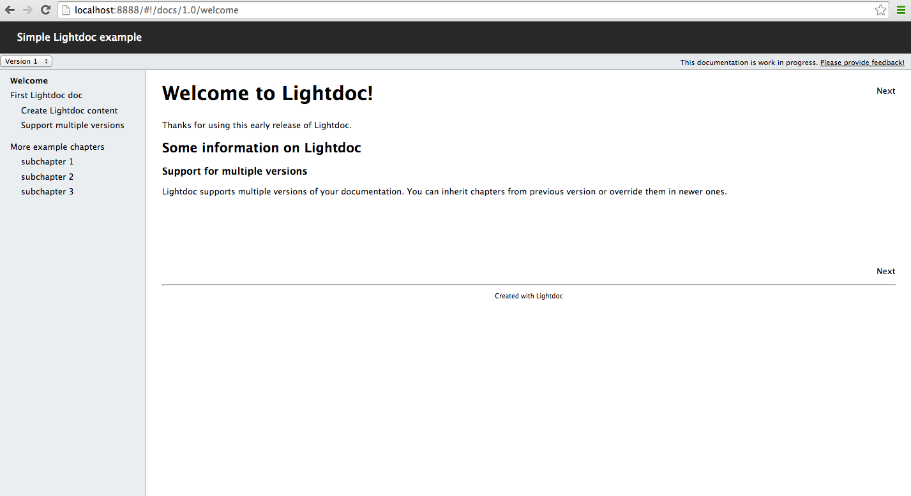
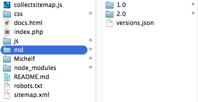
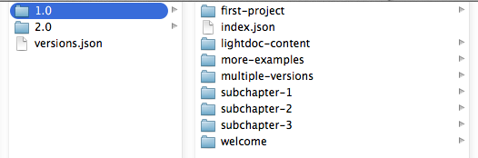
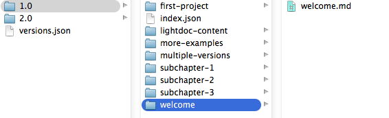
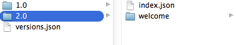

**Note: this is a very early release with fairly undocumented and unstructured code - use at own risk.**

#About Lightdoc
Lightdoc is a documentation system visually inspired by Appledoc. It allows developers to create entire documentations using Markdown and JSON. The actual documentation is written in Markdown, chapters and subchapters are arranged with JSON. 

The documentation system itself uses HTML, CSS and JavaScript only and can easily be hosted on any kind of webserver. The documentation system is SEO compatible when hosted on a PHP server.

##Key Features
- write documentation entirely in **Markdown**
- define structure of the documentation (chapters, subchapters) entirely in JSON
- manage **multiple versions of your documentation**
- host on any webserver (application only uses HTML, CSS and JavaScript), **ready to deploy on heroku**
- **SEO compatible**

##Lightdoc User Interface

##Example installations

- the [MakeGamesWithus Cocos2D and SpriteBuilder documentation](https://www.makegameswith.us/docs) uses Lightdoc with a slightly modified HTML template
- this example Lightdoc installation is hosted on [heroku](http://lightdoc.herokuapp.com/)

#How to create your own documentation
The entire documentation resides int the subfolder *md* of the main Lightdoc repository:

##Defining available versions
The *version.json* file informs Lightdoc how many versions of your documentation exist and in which subfolders they are stored. Example for the documentation in the screenshot above:

	[  
		{
			"title" : "Version 1",
			"path" : "1.0"
		}, 
		{
			"title" : "Version 2",
			"path" : "2.0"
		}
	]
When more than one version is provided Lightdoc will default to the last version in the JSON array. The user will be able to explicitly select one version from a dropdown box displayed in the top left corner of the Lightdoc interface. 

##Creating content for each version of the documentation
Each version folder contains an *index.json* that describes the structure of the chapters of this version and multiple subfolders - one for each chapter in this version:

###Setting up index.json
The *index.json* file defines chapters and subchapters of the documentation. Currently Lightdoc only supports one level of subchapters. The *index.json* for the example above looks as following:

	{   "content"  :
			[  
				{
					"title" : "Welcome",
					"path"  : "welcome",
					"version"  : "1.0"
				},
	
				{
			    	"title" : "First Lightdoc doc",
			    	"path"  : "first-project",
			    	"version" : "1.0",
			    	"children": 
			    		[
			                {
			                	"title" : "Create Lightdoc content",
			                	"path"  : "lightdoc-content",
			                	"version"  : "1.0"
			                },
							
							{	"title" : "Support multiple versions",
			                	"path"  : "multiple-versions",
			                	"version"  : "1.0"	
			                }
			            ]
			    },
				
				{
					"title" : "More example chapters",
					"path"  : "more-examples",
			        "version"  : "1.0",		                	
	
					"children": 
			    		[
			    		    {
			                	"title" : "subchapter 1",
			                	"path"  : "subchapter-1",
			                	"version"  : "1.0"
			                },
	
			                {
			                	"title" : "subchapter 2",
			                	"path"  : "subchapter-2",
			                	"version"  : "1.0"		                	
			                },
	
			               {
				            	"title" : "subchapter 3",
				            	"path"  : "subchapter-3",
				            	"version"  : "1.0"		               	
			    			}
			        	]
				}
			]
	}
	
Each chapter has following properties:

- **title**: the title is displayed in the table of contents on the left
- **path**: name of the subfolder and the *.md* file in the subfolder.
- **version**: defines which version of the chapter should be used. This can be used to inherit older versions of a chapter in a newer version of the documentation.

##Setting up a chapter

Each chapter consists of a subfolder with the name of the *path* chosen in the *index.json* and a Markdown file with the same name, for example the *welcome* chapter looks like this:

It is possible to store images locally withing subchapters and referencing them with relative filenames inside the markdown document.

##Create a new version of your documentation

Most user guides will have multiple versions, since the software or framework they document will be released in multiple versions. Most of the time the differences between versions are marginal - a lot of existing functionality stays the same, a couple of features change.

Lightdoc allows each version to include entire chapters from previous versions or to override them with new versions.

For example, version *2.0* of the example documentation only overrides the welcome chapter:
 

Only the new chapters or chapters that shall be overriden need to be added as subfolders to the newer version. The *index.json* specifies further which chapter from which version is used. Example, *index.json* from version *2.0*:

	{   "content"  :
			[  
				{
					"title" : "Welcome",
					"path"  : "welcome",
					"version"  : "2.0"
				},
	
				{
			    	"title" : "First Lightdoc doc",
			    	"path"  : "first-project",
			    	"version" : "1.0",
			    	"children": 
			    		[
			                {
			                	"title" : "Create Lightdoc content",
			                	"path"  : "lightdoc-content",
			                	"version"  : "1.0"
			                },
							
							{	"title" : "Support multiple versions",
			                	"path"  : "multiple-versions",
			                	"version"  : "1.0"	
			                }
			            ]
			    },
				
				{
					"title" : "More example chapters",
					"path"  : "more-examples",
			        "version"  : "1.0",		                	
	
					"children": 
			    		[
			    		    {
			                	"title" : "subchapter 1",
			                	"path"  : "subchapter-1",
			                	"version"  : "1.0"
			                },
	
			                {
			                	"title" : "subchapter 2",
			                	"path"  : "subchapter-2",
			                	"version"  : "1.0"		                	
			                },
	
			               {
				            	"title" : "subchapter 3",
				            	"path"  : "subchapter-3",
				            	"version"  : "1.0"		               	
			    			}
			        	]
				}
			]
	}
	
In this version of Lightdoc you need to explicitly state that you are using version *2.0* of the welcome chapter and version *1.0* of all other chapters.

#SEO features
If hosted on a PHP server Lightdoc supports the [Google Ajax Crawling Scheme] (https://developers.google.com/webmasters/ajax-crawling/docs/getting-started) which allows Google to crawl all pages of the documentation. The lightweight *index.php* will return an HTML snapshot for every page of the documentation. 

In order to support SEO Lightdoc creates a *Sitemap.xml* with links to all individual pages of the documentation - Google cannot use the Lightdoc documentation since it is loaded with JavaScript. To built the sitemap you need to have Node.js installed and run the *collectsitemap.js* file.

If you want to support SEO for your documentation you need to:

- host the documentation on a PHP server
- run `node collectsitemap.js` to build the *Sitemap.xml* (you can setup a git hook for this)
