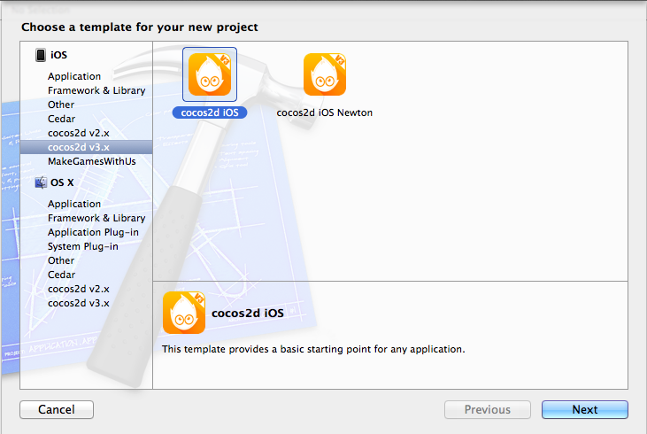

# Create a project in Xcode

## Download Cocos2D

Download the latest version of Cocos2D from [cocos2d-iphone.org](http://www.cocos2d-iphone.org/getting-started/#id-download). Run the Cocos2D installer. The installer will install new Xcode templates, so that you can create new Cocos2D projects within Xcode.

Note that you need to restart Xcode after installing these templates.

## Setup new project

Select *File > New > Project...* in Xcode. Then select the Cocos2D v3.x project template:

Now you will be set up with a simple Cocos2D project.