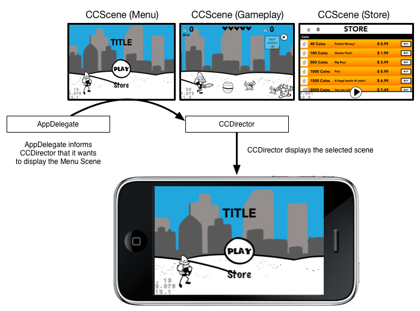

#Scenes in Cocos2D

In Cocos2D you have to have a `CCScene` as the root node of your scene graph. `CCScene` is a subclass of `CCNode`. Any `CCNode` subclass can be added to a scene by using the `addChild:` method. By default any `CCScene` is initialized as a full screen node. Only one `CCScene` can be active at a time. The currenty active scene is considered *on the stage*.

##Scene lifecycle
Cocos2D provides multiple lifecyle events that can be relevant for your scenes and other nodes in your scene. These events are trigerred when a scene gets initialized and when it becomes active/inactive. Each of the scene transition events is represented by one method in `CCNode` that gets called by the `CCDirector`. You can override these methods in any `CCNode`. The Objective-C default initializer method `init` gets called when scene/node is initialized from Cocos2D code. When you created your scene/node in SpriteBuilder `didLoadFromCCB` is the designated initializer method. Here is an overview of all the lifecycle methods:

* **init**: The default Obj-C initializer. If the scene is not created in SpriteBuilder you mostly use this method to build the scene by adding different nodes as children.

* **didLoadFromCCB**: **If you created your scene in SpriteBuilder** this method is called when the complete scene is loaded and all code connections are set up. You implement this method to access and manipulate the content of the scene. You cannot access child nodes of the scene or code connection variables before this method is called.

* **onEnter**: This method gets called as soon as the replacement of the currently active scene with this scene begins. If you are using an animated scene transition this method will be called at the beginning of the transition. You can add any code that shall be executed when the scene starts to enter the stage.

* **onEnterTransitionDidFinish**: If you are using an animated scene transition this method will be called when the transition finishes. If you are not using transitions this method is called at the same time as `onEnter`. Implement this method to execute code once the scene has fully entered the stage.

* **onExit**: Is called when the scene leaves the stage. If the scene leaves the stage with a transition, this event is called when the transition finishes.

* **onExitTransitionDidStart**: Is called when the scene leaves the stage. If the scene leaves the stage with a transition, this event is called when the transition starts.

> **Note:** you have to call the super implementation when you override `onEnter`, `onEnterTransitionDidFinish`, `onExit` or `onExitTransitionDidStart`.

##Scene Graph and Scene Management

Each `CCScene` stores a hierarchy of different `CCNode` instances. `CCScene` itself is an invisible node that is only used as a container. Most `CCNode` subclasses are used to present an object on the screen (a single color surface or a texture). The hierarchical structure of `CCNode` instances is called the *scene graph*.

The following diagram shows multiple different scenes and scene graphs of a game:

	
The diagram represents three different scenes of which each contains
multiple nodes. There are a couple
of takeaways from this diagram:

* **CCDirector** is the instance that controls which scene gets presented on the stage. One can tell `CCDirector` to present the main menu,
  the gameplay scene or the highscore scene. `CCDirector` will only
  present one scene at a time.
* **CCScenes** are used to build a logical group of objects. In
  Cocos2D this always means one scene represents one screen. One will
  have scenes for menus, leaderboards, gameplay, etc. Scenes itself don't have
  a representation, their sole goal is to group `CCNode` instances.
* **CCNodes** Basically anything that is visible in Cocos2D
  is a subclass of `CCNode`.

Games in Cocos2D consist of different scenes. The flow of the game is defined by telling the `CCDirector` when which scene shall be presented (menu first, then gameplay, then leaderboard). The content of the scenes is a compilation of different nodes.
A `CCNode` can again contain other `CCNode` instances. The hierarchy of `CCNode` instances in a scene is called the scene graph.

##Creating a Scene
The default SpriteBuilder and Cocos2D projects come with one scene. For most games you will have to create additional scenes. You can either create scenes in SpriteBuilder or in code.
	
* Create a Scene CCB-File in SpriteBuilder and load the scene in code utilizing CCBReader:   
  
		CCScene *gameplayScene = [CCBReader loadAsScene:@"Gameplay"];
  
* Create a subclass of `CCScene` in Xcode and intialize:    
  
		CCScene *gameplayScene = * [GameplayScene scene];
		
###When to create the Scene content
For most games you will create the content for your scenes in SpriteBuilder or in the `init` method of your `CCScene` subclass. However, when certain scenes need to allocate a lot of memory it can be helpful to create the actual scene content in the `onEnter` method and removing it when `onExit` is called. This way the memory is only used when the scene is active on the stage.

##Switching between Scenes
The `CCDirector` is responsible for presenting and hiding scenes.
The easiest way to replace a scene, without a transition is using the `replaceScene:` method:

	[[CCDirector sharedDirector] replaceScene:gameplayScene];
	
Using this method the `CCDirector` will replace the currently active scene with the `gameplayScene`.

###Transitioned Scene Changes
If you want to provide a transition effect for swapping the scene you can use the `replaceScene:withTransition:`. It takes a `CCTransition` as parameter. A `CCTransition` can be easily created using one of the initializer methods that provide pre defined transition effects:

	CCTransition *transition = [CCTransition transitionCrossFadeWithDuration:1.f];
    [[CCDirector sharedDirector] replaceScene:gameplayScene withTransition:transition];

To get an overview of the different available transitions and the transition options, take a look at the Cocos2D class reference for [CCTransition](http://www.cocos2d-iphone.org/api-ref/3.0-rc1/Classes/CCTransition).

###Using the Scene Navigation stack
Another option instead of replacing scenes is pushing and popping scenes. When you push a new scene, the old scene gets deactivated but remains in a the stack of scenes. When you pop a scene that scene gets removed from the navigation stack and the top most controller of the navigation stack gets presented.

Cocos2D provides methods to pop and push scenes with or without transitions:

* `pushScene:withTransition:`
* `popScene:withTransition:`
* `pushScene:`
* `popScene`

Additionally there is a `popToRootScene` method that empties the complete navigation stack and returns to the first scene.

When building User Interfaces with multiple scenes (e.g. menu structures) you should use the navigation stack instead of manually replacing scenes. The most common pattern is to provide a *back* button that pops the latest scene on the navigation stack.

