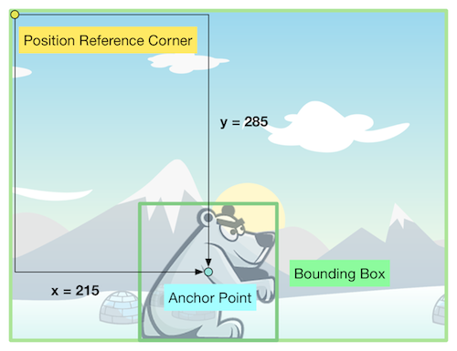
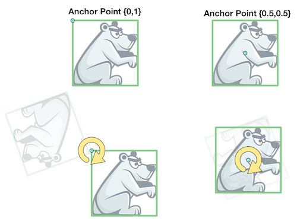

#Nodes in Cocos2D

In Cocos2D *every visible object* in a scene is a subclass of
[CCNode](http://www.cocos2d-iphone.org/api-ref/3.0-rc1/Classes/CCNode.html). Even `CCScene` is a `CCNode` subclass.

The most important `CCNode` subclasses are:

* **CCSprite**: Represents an image or an animated image. Used for characters,
  enemies, etc. in your gameplay.
* **CCNodeColor**: A plain colored node.
* **CCLabelTTF**: A node than represent text in any TTF font.
* **CCButton**: A interactive node that responds to touch input.
* **CCLayoutBox**: A node that arranges it's child nodes vertically or horizontally. Replaces `CCMenu` which was part of Cocos2D 2.x.

##Important CCNode properties
`CCNode` has a couple of important properties that will be used in most games:

* **contentSize**: the size of the node in the unit specified by contentSizeType property
* **position**:  position (x,y) of the node in the unit specified by the positionType property.
* **anchor point**: the anchor point is the center point for rotations and the reference point for positioning this node.
* **visible**: defines if `CCNode` is visible or not

The position of a node is always expressed relative to its parent node, by default relative to the bottom-left corner of the parent. Cocos2D supports multiple sizing types and position types that can be used to create dynamic layouts. For more details read this [tutorial on dynamic layouts with Spritebuilder and Cocos2d](https://www.makegameswith.us/gamernews/361/dynamic-layouts-with-spritebuilder-and-cocos2d-30).

The following diagram visualizes a couple of these properties.

- The two reference points that define a position of a node within another node are the *position reference corner* of the parent and the *anchor point* of the node. 
- By default the reference corner is the bottom-left corner. In the diagram above the reference corner is at the top-left.
- The anchor point is (0.5, 0.5) by default. The anchor point can have values between 0 and 1 for the x and y component. 0 means the left/bottom edge, 1 means the right/top position
- The *contentSize* is the size of the *boundingBox* of the `CCNode`.

###Anchor point
As mentioned above, the anchor point is not only used as reference point for positioning nodes, it is also the center of rotation (when using the rotation properties of `CCNode`). 

##Working with children of nodes
Nodes can be added as children of other nodes. This way a node hierarchy is created. 

###Adding Children

You can add a node using the `addChild:` method. All children of a `CCNode` are moved together with their parents. The position of a `CCNode` is always relative to its parent. The only exception is `CCNode` instances that have a `physicsBody` - this is covered in the physics chapter.

###Removing children

To remove a `CCNode` from another `CCNode` a developer will mostly use the `removeFromParent` method on the node that shall be removed. 

###Drawing Order of Children

By default children have a higher drawing order than their parents and are added on top of them. A developer can modify the drawing order by providing a separate *z* value. In this case the `addChild:z:` method should be used. The *z* order can also be changed by setting the `zOrder` property of the `CCNode`. 

The *z* value overrides the drawing order that is usually defined by the order the nodes have been added (the node added the latest is drawn on the top).

The drawing order is defined like this:

1. Draw all children with a *z* value below 0. The lowest value is drawn first.
2. Draw self
3. Draw all children with a *z* value of >= 0. Nodes with the same *z* value will be drawn in the reverse order of insertion.

If you, for example, wanto to draw a child node *under* its parent node, you can use a negative *z* value:

	[parentNode addChild:childNode z:-1];

##Working with multiple coordinate systems
By default positions of nodes are always expressed relative to their parent. Sometimes a developer will need to transform these positions into different coordinate systems. 

*An example:* A developer wants to check if the arm of a character has left the screen. The position of the arm is relative to the character's body. The developer needs a mechanism to retrieve the coordinates of the arm in the screen coordinate system.

Transferring coordinates into another coordinate system is a two step process in Cocos2D:

1. Retrieve the world coordinates using:   

		CGPoint worldPosition = [parentNode convertToWorldSpace:childNode.position];  
       
2. Use the world position and transform it to the node space of the target node:  
       
       
		GPoint scenePosition = [scene convertToNodeSpace:worldPosition];
       
A developer can use this mechanism to express a position in any node space.