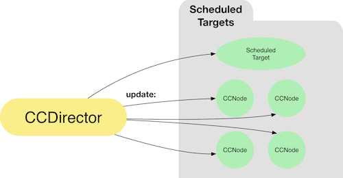

#Cocos2D update loop

Cocos2D provides an update loop that can be used from any `CCNode` subclass.
Cocos2D supports two different update methods that are called by the update loop:

- `update:(CCTime)delta` - update method with a dynamic time step. This method is called directly before a frame gets rendered. Cocos2D tries to render up to 60 frames a second. If the app consumes too much CPU time the framerate might decrease and this method may be called less often then 60 times a second. The `delta` parameter contains the miliseconds since the `update:` method was called last. 
- `fixedUpdate:(CCTime)delta` - update method that is **guaranteed** to be called at the specified interval, e.g. 60 times a second. It is recommended to use this method when changing properties of physics objects. The integrated physics engine operates on this fixed time step. In most cases, using the `fixedUpdate` method to update physical properties will lead to a more accurate physics simulation (as opposed to using the `update` method).

##Using the update loop to interact with game objects
The update loop is often used as an alternative to a `CCAction` for continous game actions.
If it is preferabale to use a `CCAction` or implement the `update:` method depends strongly on the individual game.

This is an example of moving a character through an update loop:

    - (void)update:(CCTime)delta {
        // move character to the right, 100 points a second
        self.character.position = ccp(self.character.position.x + 100*delta, self.character.position.y);
    }
    
Multiplying the position increase with `delta` ensures a framerate independent movement - the character will always move 100 points a second even if the framerate drops below 60 FPS. 

There are two options to handle delta:

- **Multiply with delta**: Game always runs at the same speed. If framerate drops the game will "jump" multiple frames at once
- **Do not multiply with delta**: If the framerate drops the game will slow down

This extensive [discussion](http://www.learn-cocos2d.com/2013/10/game-engine-multiply-delta-time-or-not/) provides some good background information on which option to choose for which game.

##Where to go from here
This concludes the very basic introduction to Cocos2D. The next chapters will describe SpriteBuilder features and how they can be used to create Cocos2D games. After the SpriteBuilder introduction all Cocos2D core features will be discussed in detail in individual chapters.
